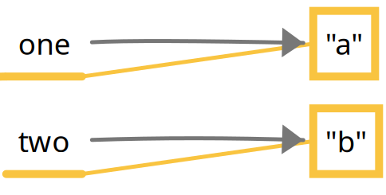
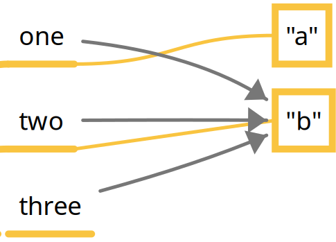

---

markmap:
  initialExpandLevel: 1
---
# **Understanding Garbage Collection**
- All Java objects are stored in your program memory’s _heap_. The
heap, which is also referred to as the _free store_, represents a 
large pool of unused memory allocated to your Java application.
  - _Garbage collection_ refers to the process of automatically freeing 
  memory on the heap by deleting objects that are no longer
  reachable in your program.
    - _Eligible for garbage collection_ refers to an object’s state of no 
    longer being accessible in a program and therefore able to be 
    garbage collected.
    Does this mean an object that’s eligible for garbage collection 
    will be immediately garbage collected? Definitely not.
    - Think of garbage-collection eligibility like shipping a package. You
    can take an item, seal it in a labeled box, and put it in your mailbox.
    This is analogous to making an item eligible for garbage collection.
    When the mail carrier comes by to pick it up, though, is not in your
    control. For example, it may be a postal holiday, or there could be a
    severe weather event. You can even call the post office and ask
    them to come pick it up right away, but there’s no way to guarantee
    when and if this will actually happen.
      - You can suggest that garbage collection run.
      `System.gc();`
      Just like the post office, Java is free to ignore you. 
      This method is not guaranteed to do anything.
- An object will remain on the heap until it is no longer reachable. An 
object is no longer reachable when one of these two situations occurs:
1.- The object no longer has any references pointing to it.
2.- All references to the object have gone out of scope.
- Look at this code and see whether you can figure out when each 
object first becomes eligible for garbage collection: (line 6 and line 9)
  - ```java
    1: public class Scope {
    2:   public static void main(String[] args) {
    3:     String one, two;
    4:     one = new String("a");
    5:     two = new String("b");
    6:     one = two;
    7:     String three = one;
    8:     one = null;
    9:   } }
    ```
    - On line 3, write `one` and `two`. On line 4, we have our first 
    object. Draw a box with the string `"a"` in it, and draw an 
    arrow from the word `one` to that box. Line 5 is similar.
    Draw another box with the string `"b"` in it this time and an 
    arrow from the word `two`. 
      - [Figure 1.4](https://1drv.ms/i/c/c83cfca51d5c2032/ESzco74WqDtIkVi6tj0Lvn4B4LFmEfaETLRM5YuP5CjZog?e=JXM7W8) 
      <!--  -->
    - On line 6, the variable `one` changes to point to `"b"`. Either erase or
    cross out the arrow from `one` and draw a new arrow from one to `"b"`.
    On line 7, we have a new variable, so write the word `three` and draw
    an arrow from three to `"b"`. Notice that `three` points to what `one` is
    pointing to right now and not what it was pointing to at the beginning. 
    This is why you are drawing pictures. It’s easy to forget something like that.
      - [Figure 1.5](https://1drv.ms/i/c/c83cfca51d5c2032/EdHyveN2HiBKkKJAC_MnQboBAeKDmT635dBE8ih9rSVZgw?e=zECHZg) 
      <!--  -->
    - Finally, cross out the line between `one` and `"b"` since line 8 sets this variable to `null`. 
    Now, we were trying to find out when the objects were first eligible for garbage collection. 
    On line 6, we got rid of the only arrow pointing to `"a"`, making that object eligible for 
    garbage collection. `"b"` has arrows pointing to it until it goes out of scope. This means 
    `"b"` is elegible for garbage collection until the end of the method on line 9.
  - You can watch the figures 1.4 and 1.5 in the book.
    