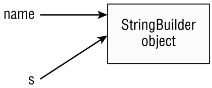

---

markmap:
  initialExpandLevel: 1
---

# **Passing Data among Methods**
  - Java is a “pass-by-value” language. This means that a copy
of the variable is made and the method receives that copy.
**Assignments made in the method do not affect the caller.**
      ```java
      2: public static void main(String[] args) {
      3:   int num = 4;
      4:   newNumber(num);
      5:   System.out.print(num); // 4
      6: }
      7: public static void newNumber(int num) {
      8:   num = 8;
      9: }
      ```
      - On line 3, `num` is assigned the value of `4`. On line 4, we call a
      method. On line 8, the `num` parameter in the method is set to 
      `8`. Although this parameter has the same name as the
      variable on line 3, this is a coincidence. The name could be
      anything. The exam will often use the same name to try to
      confuse you. The variable on line 3 never changes because
      no assignments are made to it.
        - **Passing Objects**
          Let’s try an example with a reference type. What do you
          think is output by the following code?
          ```java
          public class Dog {
            public static void main(String[] args) {
              String name = "Webby";
              speak(name);
              System.out.print(name);
          }
            public static void speak(String name) {
              name = "Georgette";
            }
          }
          ```
          - The correct answer is `Webby`. Just as in the primitive
          example, the variable assignment is only to the method
          parameter and doesn’t affect the caller.
          Notice how we keep talking about variable assignments.
          This is because we can call methods on the parameters.
            -  As an example, here is code that calls a method on the
            `StringBuilder` passed into the method:
                ```java
                public class Dog {
                  public static void main(String[] args) {
                    var name = new StringBuilder("Webby");
                    speak(name);
                    System.out.print(name); // WebbyGeorgette
                  }
                  public static void speak(StringBuilder s) {
                    s.append("Georgette");
                  }
                }
                ```
                - In this case, `speak()` calls a method on the parameter. It
                doesn’t reassign `s` to a different object. In **Figure 5.4**, you
                can see how pass-by-value is still used. The variable `s` is a
                copy of the variable `name`. Both point to the same
                `StringBuilder`, which means that changes made to the
                `StringBuilder` are available to both references.
                  - [**FIGURE 5.4**](https://1drv.ms/i/c/c83cfca51d5c2032/EU3YixDlwDdIviKn5NpW1OYB_DaTN29lMSaY7xdM5zCz-g?e=iYGrYU) Copying a reference with pass-by-value
                  <!--  -->
                    - To review, Java uses pass-by-value to get data into a
                    method. **Assigning a new primitive or reference to a
                    parameter doesn’t change the caller. Calling methods 
                    on a reference to an object can affect the caller.**
- **Returning Objects**
Getting data back from a method is easier. A copy is made
of the primitive or reference and returned from the method.
Most of the time, this returned value is used. For example,
it might be stored in a variable. If the returned value is not
used, the result is ignored. Watch for this on the exam. 
Ignored returned values are tricky.
  - Let’s try an example. Pay attention to the return types.
    ```java
    1: public class ZooTickets {
    2:   public static void main(String[] args) {
    3:     int tickets = 2;                      // tickets = 2
    4:     String guests = "abc";                // guests = abc
    5:     addTickets(tickets);                  // tickets = 2
    6:     guests = addGuests(guests);           // guests = abcd
    7:     System.out.println(tickets + guests); // 2abcd
    8:  }
    9:    public static int addTickets(int tickets) {
    10:     tickets++;
    11:     return tickets;
    12:   }
    13:   public static String addGuests(String guests) {
    14:     guests += "d";
    15:     return guests;
    16:   }
    17:}
    ```
    - This is a tricky one because there is a lot to keep track of.
    When you see such questions on the exam, write down the
    values of each variable. Lines 3 and 4 are straightforward
    assignments. Line 5 calls a method. Line 10 increments the
    method parameter to `3` but leaves the `tickets` variable in the
    `main()` method as `2`. While line 11 returns the value, the
    caller ignores it. The method call on line 6 doesn’t ignore
    the result, so `guests` becomes `"abcd"`. Remember that this is
    happening because of the returned value and not the
    method parameter.
- **Autoboxing and Unboxing Variables**
Java supports some helpful features around passing
primitive and wrapper data types, such as `int` and 
`Integer`. Remember we can explicitly convert between
primitives and wrapper classes using built-in methods.
  - ```java
    5: int quack = 5;
    6: Integer quackquack = Integer.valueOf(quack); // Convert int to Integer
    7: int quackquackquack = quackquack.intValue(); // Convert Integer to int
    ```
    - Useful, but a bit verbose. _Autoboxing_ is the process of converting 
    a primitive into its equivalent wrapper class, while _unboxing_ is the 
    process of converting a wrapper class into its equivalent primitive.
      ```java
      5: int quack = 5;
      6: Integer quackquack = quack;       // Autoboxing
      7: int quackquackquack = quackquack; // Unboxing
      ```
      - Autoboxing applies to all primitives and their associated 
      wrapper types, such as the following:
        ```java
        Short tail = 8;       // Autoboxing
        Character p = Character.valueOf('p');
        char paw = p;         // Unboxing
        Boolean nose = true;  // Autoboxing
        Integer e = Integer.valueOf(9);
        long ears = e; //Unboxing, then implicit casting
        ```
        - Each of these examples compiles without issue. In the last
        line, e is unboxed to an int value. Since an int value can be
        stored in a long variable via implicit casting, the compiler
        allows the assignment. If you change `long` in the last line 
        with `Long`, it does not compile.
          - **Limits of Autoboxing and Numeric Promotion**
While Java will implicitly cast a smaller primitive to a
larger type, as well as autobox, **it will not do both 
at the same time**. Do you see why the following 
does not compile?
            ```java
            Long badGorilla = 8; // DOES NOT COMPILE
            ```
            - The compiler will automatically cast or autobox the `int`
            value to `long` or `Integer`, respectively. Neither of these
            types can be assigned to a `Long` reference variable,
            though, so the code does not compile. Compare this
            behavior to the previous example with `ears`, where the
            unboxed primitive value could be implicitly cast to a
            larger primitive type.
              - **Java will implicitly cast a smaller primitive to a larger type, 
              as well as autobox, it will not do both at the same time.**
- What do you think happens if you try to unbox a `null`?
  ```java
  10: Character elephant = null;
  11: char badElephant = elephant; // NullPointerException
  ```
  On line 10, we store `null` in a `Character` reference. This is legal because
  a `null` reference can be assigned to any reference variable. On line 11,
   we try to unbox that `null` to a `char` primitive. This is a problem. Java
  tries to get the `char` value of `null`. Since calling any method on `null` 
  gives a `NullPointerException`, that is just what we get. Be careful when
  you see null in relation to autoboxing and unboxing.
    - Where autoboxing and unboxing really shine is when we
      apply them to method calls.
      ```java
      public class Chimpanzee {
        public void climb(long t) {}
        public void swing(Integer u) {}
        public void jump(int v) {}
        public static void main(String[] args) {
          var c = new Chimpanzee();
          c.climb(123);
          c.swing(123);
          c.jump(123L); // DOES NOT COMPILE
        }
      }
      ```
      - In this example, the call to `climb()` compiles because the `int`
      value can be implicitly cast to a `long`. The call to `swing()` also
      is permitted, because the `int` value is autoboxed to an `Integer`. 
      On the other hand, the call to `jump()` results in a compiler error 
      because a `long` must be explicitly cast to an `int`.
        - As before, the same limitation around autoboxing and
        numeric promotion applies to method calls. 
          ```java
          public class Gorilla {
            public void rest(Long x) {
              System.out.print("long");
            }
            public static void main(String[] args) {
              var g = new Gorilla();
              g.rest(8); // DOES NOT COMPILE
            }
          }
          ```
          Java will cast or autobox the value automatically, but not
          both at the same time.
            -  Finally, autoboxing can be used when initializing an array. 
            The following creates two arrays with `Integer` and `Double`
            values, respectively.
                ```java
                Integer[] openingHours = { 9, 12 };
                Double[] temperaturesAtZoo = { 74.1, 93.2 };
                ```
                - **The types have to be compatible**, though, as shown in the following
                examples.
                  ```java
                  Integer[] winterHours = { 10.5, 17.0 }; // DOES NOT COMPILE
                  Double[] summerHours = { 9, 21 }; // DOES NOT COMPILE
                  ```