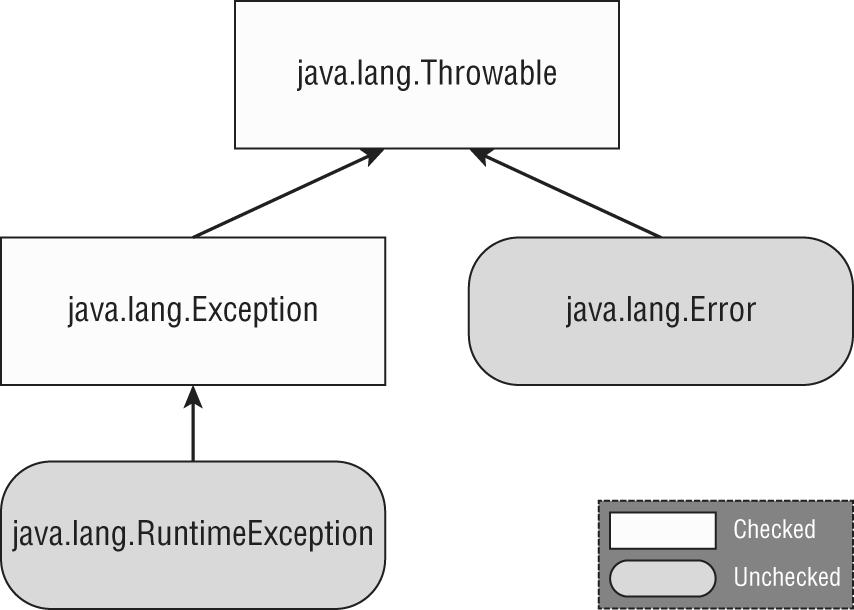

---

markmap:
  initialExpandLevel: 1
---
# **Exception**
- An exception is an event that alters program flow
- An exception is Java’s way of saying, “I give up. I don’t know what to do right now. You
deal with it.” When you write a method, you can either deal with the exception or make 
it the calling code’s problem.
- A method can handle the exception case itself or make it the caller’s responsibility
- **Understanding Exception Types**
An exception is an event that alters program flow. Java has a
`Throwable` class for all objects that represent these events. Not all
of them have the word exception in their class name, which can
be confusing. **Figure 11.1** shows the key subclasses of `Throwable`.
  - **FIGURE 11.1** Categories of exception

