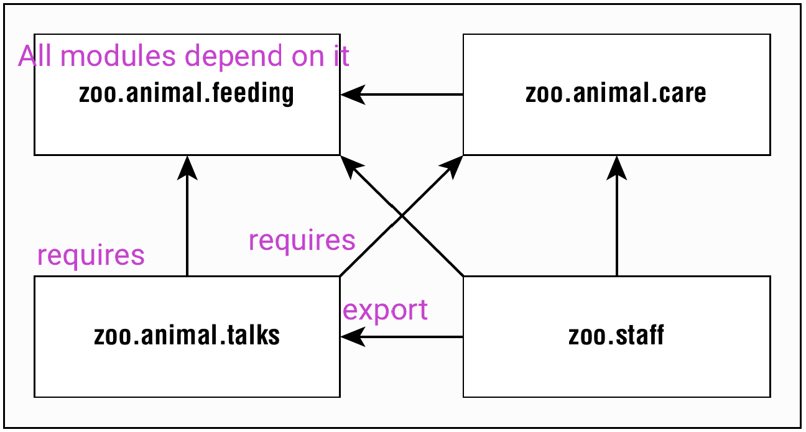

# **Introducing Modules**
- The _Java Platform Module System_ (JPMS) groups code at a higher level. The main purpose of a module 
is to provide groups of related packages that offer developers a particular set of functionality. It’s like a 
JAR file, except a developer chooses which packages are accessible outside the module.
- A _module_ is a group of one or more packages plus a special file called
`module-­info.java`. The contents of this file are the _module declaration_.

- 

  - The arrows between many of the modules, represent 
  _dependencies_.

  - The line from `zoo.staff` to `zoo.animal.feeding` shows that the 
  `staff` depends on the `feeding`.
  - `zoo.staff` must have `requires` in its `module-info.java` and 
  `zoo.animal.feeding` must have `exports` in its `module-info.java`
  - The file called `module-­info.java`. This file is required to be inside
all modules. The `module-­info.java` file is directly under the foler module.
  - For example if `feeding` is the module directory, the `module-­info.java` file is
directly under it.
- Benefits of Modules
  - **Better access control:** In addition to the levels of access control covered, you 
  can have packages that are only accessible to other packages in the module.
  - **Clearer dependency management:** Since modules specify what they rely on, Java 
  can complain about a missing JAR when starting up the program rather than when it 
  is first accessed at runtime.
  - **Custom Java builds:** You can create a Java runtime that has only the parts of the JDK
that your program needs rather than the full one at over 150 MB.
  - **Improved security:** Since you can omit parts of the JDK from your custom build, 
  you don’t have to worry about vulnerabilities discovered in a part you don’t use.
  - **Improved performance:** Another benefit of a smaller Java package is improved 
  startup time and a lower memory requirement.
  - **Unique package enforcement:** Since modules specify exposed packages, Java can 
  ensure that each package comes from only one module and avoid confusion about 
  what is being run.
# **Creating and compiling a Modular Program**
- We have the module `zoo.animal.feeding` 
  directory structure:
  ```
  ├── mods
  ├── feeding
  │   ├── module-info.java
  │   └── zoo
  │       └── animal
  │           └── feeding
  │               └── Task.java
  ```
  - In particular, `feeding` is the module directory, and the `module-­info.java` file is directly 
  under it. Just as with a regular JAR file, we also have the `zoo.animal.feeding` package 
  with one subfolder per portion of the name. The `Task` class is in the appropriate 
  subfolder for its package. Also, note that we have a directory called `mods` at the 
  same level as the module.
- `module-info.java` contains:
  ```
  module zoo.animal.feeding {
    exports zoo.animal.feeding;
  }
  ```
  - There are a few key differences between a module declaration and a regular Java class declaration:
  1\. The `module-­info.java` file must be in the root directory of your module. Regular Java classes should 
  be in packages.
  2\. The module declaration must use the keyword `module` instead of `class` , `interface` , or `enum`.
  3\. The module name follows the naming rules for package names. It often includes periods (`.`) in its 
  name. Regular class and package names are not allowed to have dashes (`-­`). Module names follow 
  the same rule.
  - key points to note:
  `exports package;`
  `exports package to modulename;`
  **`exports` uses packages**
- Compiling the `zoo.animal.feeding` module.
  ```
  javac -­-­module-­path mods 
    -­d feeding 
    feeding/zoo/animal/feeding/*.java feeding/module-­info.java
  ```
  - The `-­d` option specifies the directory to place the class files in. The end of the command is a list of the `.java` 
  files to compile. You can list the files individually or use a wildcard for all `.java` files in a subdirectory.
  The new part is `--module-­path`. This option indicates the location of any custom module files. In this example,
  `--module-­path` could have been omitted since there are no dependencies. You can think of `--module-­path` 
  as replacing the `classpath` option when you are working on a modular program.
- The syntax `-­-­module-­path` and `-­p` are equivalent.
- ```
  javac -­p mods -­d feeding feeding/zoo/animal/feeding/ 
  ```
  - ```
    *.java feeding/*.java
    ```
  - ```
    *.java feeding/module-­info.java
    ```
  - ```
    Task.java feeding/module-­info.java
    ```
  - ```
    Task.java feeding/*.java
    ```
- Options that you need to know for using modules with `javac`
  - Directory for class files
    - `-­d <dir>`
  - Module path
    - `-­p <path>`
    - `-­-­module-­path <path>`
# **Running a Modular Program**
- Suppose there is a module named `book.module`. Inside that module is a package 
named `com.sybex`, which has a class named `OCP` with a `main()` method.
We have modules inside the `mods` directory and we also have the module called 
`book.module` and inside the `com.sybex` package the `OCP` class with a `main()` 
method, therefore to execute the module we have the following commands:
  - ```
    java --module-path mods --module book.module/com.sybex.OCP
    java -p mods -m book.module/com.sybex.OCP
    ```
  - Pay special attention to the `book.module/com.sybex.OCP` part. It is important 
  to remember that you specify the module name followed by a slash (`/`) 
  followed by the fully qualified class name.
  - There is a short form of `-­-­module` as well. The short option is `-­m`.
- ```
  java -­-­module-­path feeding
    -­-­module zoo.animal.feeding/zoo.animal.feeding.Task
  

  java -­p feeding
    -­m zoo.animal.feeding/zoo.animal.feeding.Task
  ```
  - We used `feeding` as the module path because that is where we 
  compiled the code. This will change once we package the module.
  - Module name 
    - ```
      -m <name>
      --module <name>
      ```
  - Module path
    - ```
      -p <name>
      --module-path <name>
      ```
- Packaging Module
  - ```
    jar -­cvf mods/zoo.animal.feeding.jar -­C feeding/ .
    ```
    - Now let’s run the program again, but this time using the 
    `mods` directory instead of the loose classes:
      ```
      java -­p mods
        -­m zoo.animal.feeding/zoo.animal.feeding.Task
      ```